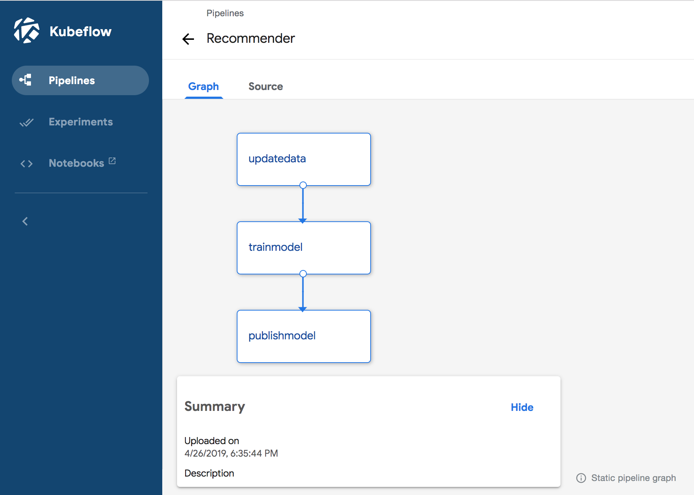
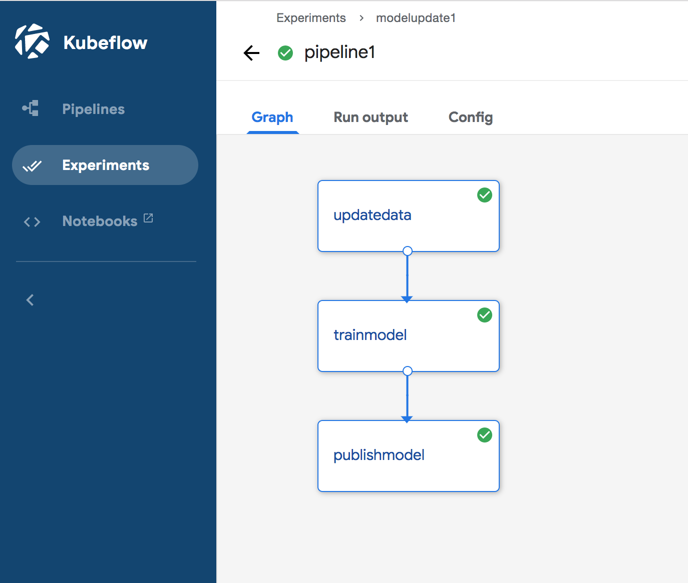
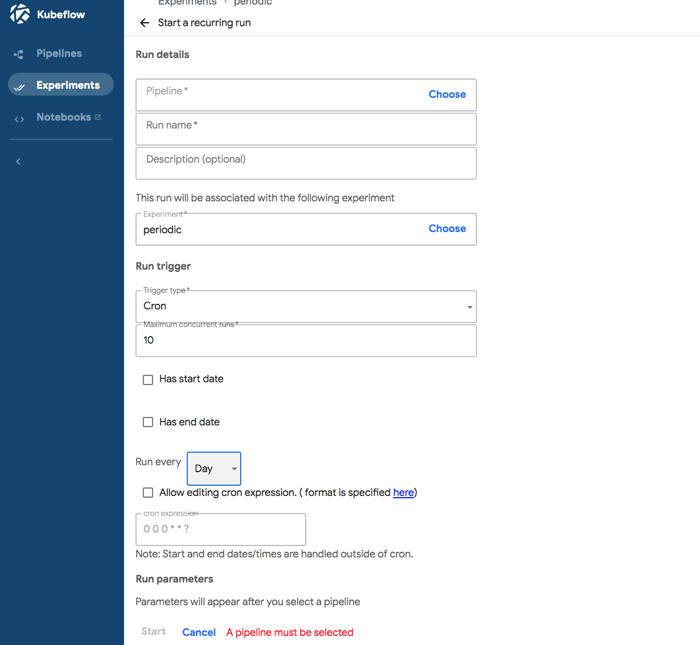
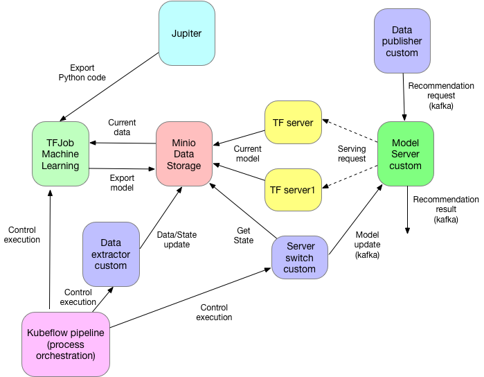

# Recommender example for kubeflow

This is an end-to-end example showing how to use Kubeflow for both machine learning and model serving.

The example consists of the following steps:
* Building machine learning using [Kubeflow's Jupiter](https://www.kubeflow.org/docs/components/jupyter/)
The machine learning implementation is using [Collaborative filtering](https://en.wikipedia.org/wiki/Collaborative_filtering)
to recommend products to the user (out of the set of products) based on his purchsing history. An implementation
is first converts purchasing history to the rating matrix, based on this [blog post](https://medium.com/datadriveninvestor/how-to-build-a-recommendation-system-for-purchase-data-step-by-step-d6d7a78800b6)
and then uses this matrix to build a prediction model, following this [repository](https://github.com/Piyushdharkar/Collaborative-Filtering-Using-Keras)
THe actual notebook can be found [here](recommender/Recommender_Kubeflow.ipynb)
* Once model is build, the python code is exported ([see here](recommender/Recommender_Kubeflow.py)) and is used for building 
[TFJob](https://www.kubeflow.org/docs/components/tftraining/). The Dockerfile is [here](recommender/Dockerfile). In addition
there is a [bash file](recommender/build.sh).
* Model serving is based on [TF-serving](https://www.kubeflow.org/docs/components/tfserving_new/). Due to limitations of [TF-serving](https://www.tensorflow.org/tfx/serving/serving_config#configuring_one_model)
I have decided to run two instances of TF-serving and alterate their usage for serving.
* KubeFlow Pipeline used to coordinate execution of steps. Notebook for creation and execution of pipeline is [here](pipelines/Pipelines.ipynb). Python code
for pipeline creation is [here](pipelines/Pipelines.py). Once the Python code runs, it creates a file, called `pipeline.tar.gz`. Following this
[example](https://github.com/kubeflow/examples/tree/master/pipelines/mnist-pipelines), the definition can be uploaded to the pipelines UI. Now we can view the pipeline there
. In addition we can also run pipeline from there, that produces
the following result:

Currectly pipelines do not allow to define periodic definition in the pipeline definition, but from UI, it is possible 
to configure run as recurring and specify how often the run is executed
 

Additional components included in this implementation include the following:
* [Data Publister](datapublisher) is a project used for preparing new data for
machine learning. Whichever code is necessary to get the list of users and their 
current purchasing history goes here. For the simple implementation here I am not doing 
here anything - just give a [code sample](datapublisher/src/main/scala/com/lightbend/recommender/datapublisher/DataPublisher.scala)
oh how to update data used for learning.
* [Model server](modelserver) is a project implementing an actual model serving. It gets a stream
of data and leverages TF Serving for the actual model serving. Additionally,
it implements the second stream, that allows to change the URL of TF-serving based on the model update
* [Model Publisher](modelpublisher) is a project responsible for updating model for Model server.
It reads a current TF-server from a data file, makes sure that it is operational (by sending it HTTP request)
and if it is, publishes a new model (new URL) to the model server. 
The acual code is [here](modelpublisher/src/main/scala/com/lightbend/recommender/modelpublisher/ModelPublisher.scala).
* [Client](client) is a project responsible for publishing recommendation requests
to the model server. Code is [here](client/src/main/scala/com/lightbend/recommender/client/client/DataProviderCloud.scala).

For storing data used in the project (models, data) we are using [Minio](https://min.io/), which is part of Kubeflow installation. 

Finally we are using [Kubeflow pipelines](https://www.kubeflow.org/docs/components/pipelines/) for organizing and scheduling overall execution.  

The overall architecture of implementation is presented below:


## Building

Different pieces are build differently. Python code - recommender ML - is directly build into docker (see above)
The rest of the code is is leveraging [SBT Docker plugin] and can be build using the following command:
```` 
sbt docker
````
that produces all images locally. These images have to be pushed into repository accessable from the cluster.
I was using [Docker Hub](https://hub.docker.com/)

## Installation

Installation requires several steps:
* install kubeflow following the following [blog posts](https://www.lightbend.com/blog/how-to-deploy-kubeflow-on-lightbend-platform-openshift-introduction)
* Install kafka as described [here](kafka/README.md)
* Populate minio with [test data](data) following [this post](https://www.lightbend.com/blog/how-to-deploy-kubeflow-on-lightbend-platform-openshift-support-components-kubeflow)
* Start Jupiter, following this [blog post](https://www.lightbend.com/blog/how-to-deploy-kubeflow-on-lightbend-platform-openshift-jupyterhub-with-kubeflow) and
test the [notebook](recommender/Recommender_Kubeflow.ipynb)
* Try usage of TFJob for machine learning, following this [blog post](https://www.lightbend.com/blog/how-to-deploy-kubeflow-on-lightbend-platform-openshift-kubeflow-tensorflow-jobs)
Ksonnet definitions for these can be found [here](ks_app/README.md)
* Deploy model serving components recommender and recommender1 following [this blog posts](https://www.lightbend.com/blog/how-to-deploy-kubeflow-on-lightbend-platform-openshift-kubeflow-model-serving) 
Ksonnet definitions for these can be found [here](ks_app/README.md)
* Deploy Strimzi following this [documentation](https://developer.lightbend.com/guides/openshift-deployment/lagom/deploying-kafka.html#installing-strimzi). Choose Strimzi version that you need.
After the operator is installed, use this [yaml file](kafka/kafka.yaml) to create Kafka cluster 
* Deploy model server and request provider using this [chart](recommenderchart)
* Enable usage of Argo following [blog post](https://www.lightbend.com/blog/how-to-deploy-kubeflow-on-lightbend-platform-openshift-support-components-kubeflow)
* Enable usage of Kubeflow pipelines following [blog post](https://www.lightbend.com/blog/how-to-deploy-kubeflow-on-lightbend-platform-openshift-deploying-kubeflow-pipelines)
* Test pipeline from the [notebook](pipelines/Pipelines.ipynb)
* Build pipeline definition using [Python code](pipelines/Pipelines.py) and upload it to the pipeline UI
* Start recurring pipeline execution.

## License

Copyright (C) 2019 Lightbend Inc. (https://www.lightbend.com).

Licensed under the Apache License, Version 2.0 (the "License"); you may not use this project except in compliance with the License. You may obtain a copy of the License at http://www.apache.org/licenses/LICENSE-2.0.

Unless required by applicable law or agreed to in writing, software distributed under the License is distributed on an "AS IS" BASIS, WITHOUT WARRANTIES OR CONDITIONS OF ANY KIND, either express or implied. See the License for the specific language governing permissions and limitations under the License.
